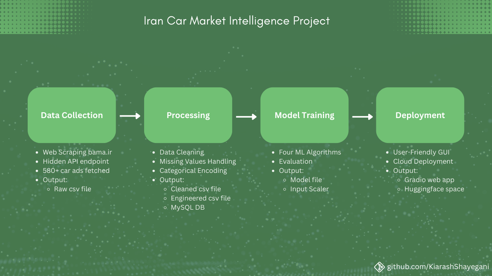

# 🚗 Iran Car Market Intelligence

**An ML-powered car price estimation system for Iran's automotive market, featuring data scraping, model training, and deployment to provide intelligent price predictions beyond basic database queries.**

[](https://huggingface.co/spaces/kiarash2077/pride_car_price_estimator)
[](LICENSE)
[](https://www.python.org/downloads/)
[](https://github.com/KiarashShayegani/iranian-car-market-intelligence)

## 📖 Project Origin

> *"When navigating Iran's volatile car market, both buyers and sellers face a common challenge: determining a fair price for a vehicle. Existing platforms often rely on simple database queries that return minimum, maximum, and average prices—useful, but potentially missing complex patterns and vulnerable to outliers.*
>
>*This project began with a question: Could machine learning provide more nuanced price estimations by learning from actual market data? Starting with Pride cars (Iran's most common vehicle), I built a complete pipeline—from data collection to deployment—to explore whether ML models could offer a complementary approach to traditional price estimation methods."*

## 🔍 What This Project Is

- A **complete ML pipeline** for car price estimation, tailored for Iran's market
- A **data-driven approach** that learns from real listings on bama.ir
- A **modular system** with scraping, cleaning, training, and deployment components
- An **exploratory project** comparing multiple ML algorithms on automotive data
- A **practical application** deployed as an interactive web interface

## 🏗️ Architecture Overview

The system follows a structured pipeline:



## 📈 Technical Implementation

### Data Pipeline
- **Scraping**: Extracts 580+ Pride car listings from bama.ir with Persian text handling
- **Cleaning**: Processes unique Iranian market features (کارکرده mileage, Persian trim names)
- **Database**: Stores structured data in MySQL with UTF-8 support for Persian characters
- **Encoding**: Custom ordinal encoding for Iranian-specific features (body_status hierarchy)

### Machine Learning Models
Four algorithms were trained and compared:

| Model | R² Score | Key Characteristics |
|-------|----------|---------------------|
| **Random Forest** | 0.872 | Best overall performance, handles non-linear relationships |
| **XGBoost** | 0.865 | Fast training, good with tabular data |
| **Neural Network** | 0.843 | Deep learning approach, more complex architecture |
| **Linear Regression** | 0.812 | Simple baseline model |

### Features Used
```
'name' → Car model name (encoded)
'trim' → Trim level (ordinal encoded)
'mileage' → Kilometers driven (imputed for 'کارکرده')
'fuel' → Fuel type (بنزینی/دوگانه سوز)
'transmission' → Transmission type (دنده ای/اتوماتیک)
'body_status' → Body condition (15-level hierarchy)
'age' → Car age (calculated from year)
```

## 🚀 Live Demo

Try the interactive price estimator:
- **Live App**: [Pride Car Price Estimator on Hugging Face](https://huggingface.co/spaces/kiarash2077/pride_car_price_estimator)
- **Current Scope**: Pride cars (Saipa) only
- **Features**: All input parameters with Persian interface support
> *Screenshot of Web Application GUI*

> 

---

## 🤝 Contributing

This project welcomes contributions! Whether you're interested in:
- Adding support for more car brands
- Improving the ML models
- Enhancing the web interface
- Optimizing the data pipeline

Please feel free to open issues or submit pull requests.

## 📄 License

This project is licensed under the MIT License - see the [LICENSE](LICENSE) file for details.

## 🙏 Acknowledgments

- Data sourced from [bama.ir](https://bama.ir)
- Built as a practical ML engineering project
- Special thanks to the open-source community for the tools and libraries used

---

**Disclaimer**: This is an educational project demonstrating ML pipeline development. Price estimations should be verified with multiple sources for real purchase/sale decisions.
