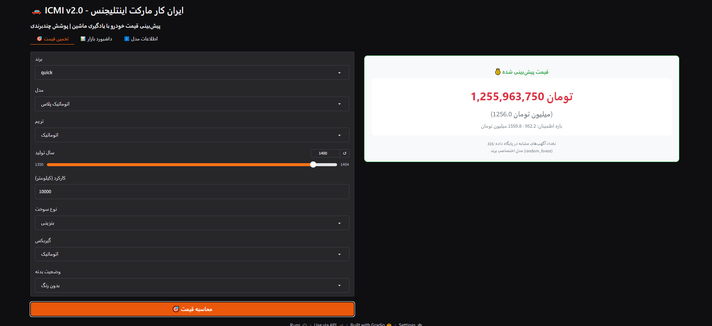
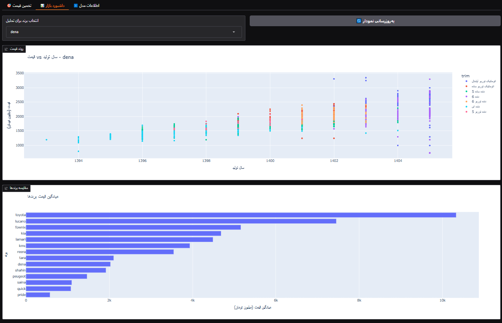
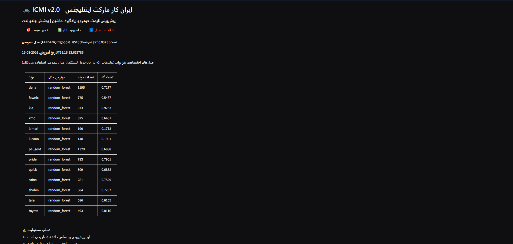

# 🚗 ICMI — Iran Car Market Intelligence

> ML-powered car price estimation and market analytics for Iran's automotive market.
> Multi-brand • Multi-model • Self-updating dataset • Free & open source

[](https://www.python.org/downloads/)
[](LICENSE)
[](https://gradio.app)

ICMI scrapes daily car listings for 14 popular brands in the Iranian market, cleans and
validates them, trains a best-of-four ML model (CatBoost / XGBoost / RandomForest / MLP)
**per brand**, and serves price estimates + market analytics through a Gradio web app.

**Status: active development (v2.0.x).** This is a working end-to-end pipeline, not yet
the final product — see [ROADMAP.md](ROADMAP.md) for where it's headed.

---

## 📸 Screenshots

<!--
  Run `python app/gradio_app.py`, open http://localhost:7860, and drop
  screenshots into docs/images/ with these filenames. PNG, ~1200px wide,
  cropped to the browser window looks best.
-->

### 🎯 Price Estimation


### 📊 Market Dashboard


### ℹ️ Model Info


---

## ✨ What makes this more than a CatBoost demo

- **Best-of-4 model selection, per brand.** Every brand's data trains CatBoost, XGBoost,
  RandomForest, and an MLP; only the cross-validated winner is kept. A brand with too
  little data automatically falls back to one global model trained on everything.
- **Self-growing dataset.** Every pipeline run merges into a cumulative
  `data/raw/master_history.parquet` instead of overwriting a single day's snapshot —
  the model has more to learn from every day the [daily GitHub Action](.github/workflows/daily_pipeline.yml) runs.
- **Non-fatal, auditable validation.** Bad rows are dropped with a logged reason instead
  of crashing the whole run, and the actual offending rows are written to
  `data/skipped_rows.csv` (scraper stage) and `data/validation_dropped_rows.csv`
  (validation stage) so you can see exactly what's being filtered and why.
- **Calendar-aware.** bama.ir mixes Shamsi and Gregorian years across brands (mostly on
  imported cars) — the scraper detects and normalizes this instead of silently dropping
  ~60-95% of some brands' listings.

See [docs/ARCHITECTURE.md](docs/ARCHITECTURE.md) for the full data flow.

---

## 🚀 Quick Start

```bash
# 1. Clone and enter
git clone https://github.com/KiarashShayegani/ICMI.git
cd ICMI

# 2. Create virtual environment (Python 3.10+ required)
python -m venv venv
source venv/bin/activate        # Windows: venv\Scripts\activate

# 3. Install dependencies
pip install -r requirements.txt

# 4. Run the full pipeline (scrape → validate → clean → train)
python run_pipeline.py

# 5. Launch the Gradio app locally
python app/gradio_app.py
# open http://localhost:7860
```

First run takes a while (scraping + training 14 brands). Subsequent runs are faster and
the dataset grows each time via `master_history.parquet`.

---

## 📁 Project Structure

```
ICMI/
├── .github/workflows/daily_pipeline.yml   # scheduled scrape+train automation
├── app/
│   └── gradio_app.py               # price estimator + market dashboard UI
├── artifacts/
│   ├── models/                     # {brand}.joblib + global.joblib (gitignored)
│   ├── metadata/                   # per-brand training comparison + summary (gitignored)
│   └── scalers/                    # currently unused - see docs/ARCHITECTURE.md
├── config/
│   └── brands.yaml                 # brands, scraping/validation/training config
├── data/
│   ├── raw/                        # timestamped snapshots + master_history.parquet
│   ├── processed/                  # ML-ready processed_latest.parquet
│   ├── skipped_rows.csv            # ads the scraper couldn't parse, with why (gitignored)
│   ├── validation_dropped_rows.csv # rows that failed schema validation, with why (gitignored)
│   └── icmi.db                     # SQLite mirror of the processed data (gitignored)
├── docs/
│   ├── ARCHITECTURE.md             # full data flow + design decisions
│   ├── DEPLOYMENT.md               # Hugging Face Spaces deployment guide
│   └── images/                     # README screenshots
├── src/
│   ├── scraper.py                  # bama.ir scraper (retry, Gregorian-year fix, diagnostics)
│   ├── validator.py                # pandera schemas, non-fatal row-level validation
│   ├── cleaner.py                  # per-brand outlier removal + feature engineering
│   ├── database.py                 # SQLite upsert + CSV export
│   ├── trainer.py                  # multi-model per-brand training + global fallback
│   └── utils.py                    # logging setup
├── run_pipeline.py                 # end-to-end orchestrator
├── requirements.txt
├── pyproject.toml
├── CHANGELOG.md
├── ROADMAP.md
└── README.md
```

---

## 🧠 How the model training works

For each brand with ≥60 listings, `src/trainer.py` trains **CatBoost, XGBoost,
RandomForest, and an MLP** on the same train/test split, cross-validates all four, and
keeps only the winner (`artifacts/models/{brand}.joblib`). Brands with less data use one
`global.joblib` model trained on every brand combined. No target leakage: categorical
features (brand, name, trim, fuel, transmission, body condition) are either handled
natively (CatBoost) or one-hot encoded (everyone else) — never encoded using the price
column itself.

The Gradio "Model Info" tab shows which algorithm won for each brand and its test R².

---

## ⚠️ Disclaimer

Price estimates are based on historical listing data and are **not** professional
valuations. Iran's car market is volatile; always consult a real expert before a
transaction. This project is for educational/portfolio purposes.

---

## 📄 License

MIT — see [LICENSE](LICENSE).
