# ICMI Architecture & Data Flow

This document explains how data moves through the pipeline, and the reasoning behind
the non-obvious design decisions. For "how do I run it," see the main
[README.md](../README.md).

## End-to-end flow

```mermaid
flowchart TD
    A[bama.ir hidden API] -->|scraper.py| B[Raw ads, per brand]
    B -->|_parse_ad: price/year/type filtering| C{Valid ad?}
    C -->|No| SK[data/skipped_rows.csv<br/>reason + raw fields]
    C -->|Yes| D[data/raw/&#123;brand&#125;_&#123;timestamp&#125;.parquet]
    D --> E[combined_latest.parquet<br/>this run's snapshot]
    E -->|append_to_master| F[(data/raw/master_history.parquet<br/>grows every run)]

    F -->|validator.py: validate_raw| G{Schema OK?}
    G -->|Row fails| DR[data/validation_dropped_rows.csv<br/>row + which check failed]
    G -->|Row passes| H[cleaner.py: DataCleaner]

    H --> H1[strip strings]
    H1 --> H2[remove outliers<br/>per-brand IQR]
    H2 --> H3[impute mileage<br/>year-group medians]
    H3 --> H4[engineer age, body_status_ordinal]
    H4 -->|validator.py: validate_processed| I{Schema OK?}
    I -->|Row fails| DR
    I -->|Row passes| J[data/processed/processed_latest.parquet]

    J --> K[database.py: CarDatabase]
    K --> K1[(data/icmi.db SQLite)]
    K --> K2[data/export/listings.csv]

    J --> L[trainer.py: ModelTrainer]
    L --> L1[Train GLOBAL model<br/>all brands combined]
    L --> L2{Brand has<br/>≥60 rows?}
    L2 -->|No| L1
    L2 -->|Yes| L3[Train CatBoost, XGBoost,<br/>RandomForest, MLP for this brand]
    L3 --> L4[Keep cross-validated winner]
    L4 --> M[artifacts/models/&#123;brand&#125;.joblib]
    L1 --> M2[artifacts/models/global.joblib]
    L3 -.-> S[artifacts/metadata/&#123;brand&#125;_metadata.json<br/>all 4 candidates' scores]

    M --> N[app/gradio_app.py]
    M2 --> N
    J --> N
    N --> O[Price estimate + confidence interval]
    N --> P[Market dashboard charts]
```

## Why each design choice

### Non-fatal, row-level validation (not exception-on-first-error)
Early versions crashed the entire pipeline on a handful of corrupted rows (e.g. a price
of 2 trillion Toman from a parsing glitch). `pandera` schemas now use `coerce=True` to
auto-fix dtype mismatches, and `_validate_non_fatal()` in `validator.py` drops only the
specific rows that fail a *data* check (price out of range, unexpected fuel value,
etc.), logging exactly which rows and why to `data/validation_dropped_rows.csv`. A
whole-column failure that coercion can't fix still raises — that indicates a real
upstream bug, not bad data.

### Cumulative master history, not daily overwrite
`combined_latest.parquet` is kept per-run for debugging, but `append_to_master()`
merges every run into `data/raw/master_history.parquet`, keyed by `listing_id`,
keeping the earliest `first_seen_at` and the latest snapshot of everything else. This
is what lets the daily GitHub Action actually improve the dataset over time instead of
retraining on the same ~1 day's worth of listings forever.

### Gregorian ↔ Shamsi year normalization
bama.ir reports `year` in the Shamsi calendar for most domestic brands but in the
Gregorian calendar for many `manufacturer: imported` listings (confirmed empirically:
toyota/kia were losing 60-95% of their ads to `invalid_year` before this fix — see
`CHANGELOG.md`). `scraper.py::_normalize_year()` detects a plausible Gregorian year
(1900-2100) and converts it (`year - 621`) instead of dropping the ad. This is a
year-only approximation (no month data from the API), so it can be off by one Shamsi
year right around Nowruz (~March 21) — fine for an `age` feature, not something to
treat as exact.

### Per-brand outlier removal and per-brand model selection
A single global price/mileage IQR band doesn't make sense across brands spanning cheap
economy cars and expensive imports — `cleaner.py::_remove_outliers()` computes IQR
bounds separately per `brand_slug`. The same logic extends to model training: a
`Pride` and an imported `Toyota` have very different price distributions and market
dynamics, so each brand with enough data (≥60 rows, configurable in
`config/brands.yaml`) gets its own dedicated best-of-4 model rather than one model
trying to generalize across all of them.

### Self-contained model artifacts (no separate scaler files)
`artifacts/scalers/` exists in the folder layout but is currently unused. This isn't
an oversight — each trained model is saved as one `joblib` **pipeline** artifact
(`artifacts/models/{brand}.joblib`) that bundles its own preprocessing:
- CatBoost gets raw categorical strings (native handling, no leakage-prone encoding).
- XGBoost / RandomForest / MLP go through a `ColumnTransformer` with `OneHotEncoder`
  for categoricals; the MLP additionally gets a `StandardScaler` for its numeric
  features, fitted and saved *inside the same pipeline object*.

Saving the fitted scaler/encoder separately from the model is a common source of
production ML bugs (forgetting to apply it at inference, or a version mismatch between
saved scaler and model). Bundling them into one `Pipeline` object removes that failure
mode entirely — `pipeline.predict(raw_input_df)` always applies the exact
preprocessing that pipeline was trained with. See `README.md`'s Q&A note on this.

### CatBoost + `cross_val_score` clone incompatibility
`sklearn.model_selection.cross_val_score` calls `sklearn.clone()` internally, and
CatBoost's `cat_features` constructor parameter breaks sklearn's clone contract
(`get_params()` doesn't round-trip exactly what was passed to `__init__`). This
silently failed CatBoost on *every single* cross-validation call, meaning it could
never win a comparison even when it was genuinely the best model. `trainer.py` now
runs a manual `KFold` loop that refits the same pipeline instance per fold instead of
cloning it — identical behavior for every candidate, no clone() involved.

### Skip/drop diagnostics as first-class output
Both `data/skipped_rows.csv` (scraper-level: not-an-ad, no price, unparseable year,
parse error) and `data/validation_dropped_rows.csv` (validator-level: out-of-range
price, unexpected fuel value, etc.) are append-only CSVs with the actual offending
data and the reason. This turned "357 rows dropped for a fuel check" from a mystery
into something you can `pandas.read_csv()` and immediately see is diesel/hybrid
listings from the imported brands. Both are gitignored (they regenerate every run).
