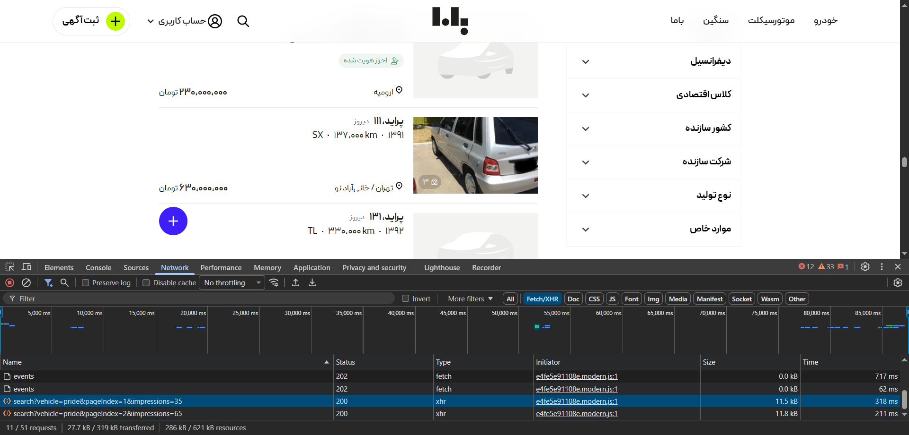
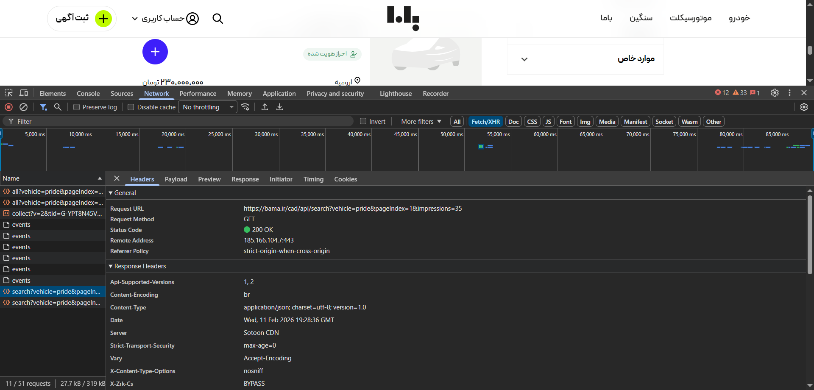

# 🕵️ How Bama.ir Was Scraped: API Reverse-Engineering

## ❌ The Obstacle

Bama.ir is a **dynamic React app** and uses cliend-side rendering. Traditional scraping with `requests` + `BeautifulSoup` only returns **4 hardcoded ads**—the HTML skeleton. The remaining 500+ listings never appear in static HTML source.

---

## 🔍 The Discovery

**Chrome DevTools → Network → Fetch/XHR filter**

While inspecting page activity, a request to `bama.ir/cad/api/search?vehicle=pride&pageIndex=1` appeared—returning **clean JSON** with 20+ ads per response.

---

> **Pattern identified:** `https://bama.ir/cad/api/search?vehicle=pride&pageIndex={page}`

---

## 💡 The Solution

**Direct pagination loop.** No Selenium. No browser. Just the taking advatage of hidden API endpoint.

**Result:** 580+ Pride ads in under 30 seconds.

---

*"When the frontend hides data, ask the backend directly."*
